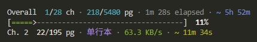

# manhuagui-cli

<p align="center">
  <a href="https://www.npmjs.com/package/manhuagui-cli"></a>
  <a href="https://nodejs.org/">= 22"></a>
  <a href="./LICENSE"></a>
</p>

<p align="center">
  <strong>manhuagui.com comic downloader CLI tool</strong>
</p>

<p align="center">
  <a href="./README.md">中文</a>
</p>

<p align="center">
  
</p>

## Quick Start

```bash
npm install -g manhuagui-cli

manhuagui-cli
```

## Features

- Interactive mode: wizard-style prompts to enter URL, select section groups and chapters
- CLI mode: full CLI arguments for scripting and automation
- Anti-bot bypass: Playwright headless Chromium for JS-obfuscated pages and anti-detection
- Identity spoofing: random User-Agent and viewport rotation to simulate real users
- CDN failover: automatic CDN node rotation with retry on failure (default 3 times)
- Concurrency control: concurrent image downloads within chapters, sequential chapters with random delays
- Real-time progress: terminal progress bars with speed, chapter/total progress, and ETA
- Preview mode (`--dry-run`): list chapters to download without downloading
- Resume support: auto-saves progress to `progress.json`, continue with `--resume` / `-r`
- Clean output: `output/<comic>/<section>/<chapter>/001.webp`

## Installation

### npm (recommended)

```bash
npm install -g manhuagui-cli
```

The `manhuagui-cli` command is available immediately. Playwright will auto-download Chromium on first run.

### From source

```bash
git clone https://github.com/wooloo26/manhuagui-cli.git
cd manhuagui-cli
pnpm install
pnpm build
pnpm link --global
```

## Usage

### Interactive mode

Run without arguments for step-by-step guidance:

```bash
manhuagui-cli
```

Flow: enter comic URL -> parse info -> select sections (multi-select) -> start download.

### CLI mode

```bash
# Show help
manhuagui-cli --help

# Download a specific section
manhuagui-cli https://www.manhuagui.com/comic/12345/ -s "单行本"

# Download a specific chapter
manhuagui-cli https://www.manhuagui.com/comic/12345/ -s "单话" -c "第01话"

# Specify output directory
manhuagui-cli https://www.manhuagui.com/comic/12345/ -o ./my-comics

# Resume download
manhuagui-cli https://www.manhuagui.com/comic/12345/ --resume

# Preview mode (no actual download)
manhuagui-cli https://www.manhuagui.com/comic/12345/ --dry-run
```

### Options

| Option                  | Default    | Description                                    |
| ----------------------- | ---------- | ---------------------------------------------- |
| `-s, --section <name>`  | All        | Section group name                             |
| `-c, --chapter <name>`  | —          | Chapter name                                   |
| `-o, --output <dir>`    | `./output` | Output directory                               |
| `-C, --concurrency <n>` | `2`        | Image download concurrency per chapter         |
| `--retry <n>`           | `3`        | Image download retry count                     |
| `--log-level <level>`   | `info`     | Log level: `debug` / `info` / `warn` / `error` |
| `-r, --resume`          | —          | Resume mode                                    |
| `-d, --dry-run`         | —          | Preview mode (no download)                     |
| `-h, --help`            | —          | Show help                                      |
| `-v, --version`         | —          | Show version                                   |

## Configuration

In addition to CLI arguments, behavior can be adjusted via environment variables.

**Priority**: CLI args > env vars > defaults

Copy `.env.example` to `.env` and modify as needed, or set system environment variables directly.

| Variable             | Default    | Description                                       |
| -------------------- | ---------- | ------------------------------------------------- |
| `OUTPUT_BASE`        | `./output` | Output directory                                  |
| `IMAGE_CONCURRENCY`  | `2`        | Image download concurrency per chapter            |
| `DOWNLOAD_DELAY`     | `3000`     | Delay between image batches (ms, 0 to disable)    |
| `CHAPTER_DELAY_MIN`  | `3000`     | Minimum delay between chapters (ms)               |
| `CHAPTER_DELAY_MAX`  | `6000`     | Maximum delay between chapters (ms)               |
| `RETRY_COUNT`        | `3`        | Image download retry count                        |
| `RETRY_BACKOFF_BASE` | `1000`     | Retry backoff base (ms), Nth retry waits N * base |
| `IMAGE_LOAD_DELAY`   | `200`      | Delay after page flip for image load (ms)         |
| `LOG_LEVEL`          | `info`     | Log level: `debug` / `info` / `warn` / `error`    |
| `USER_AGENTS`        | —          | Custom User-Agent list (one per line)             |

## Output Structure

```text
output/
└── <comic>/
    ├── progress.json         # Download progress (for resume)
    └── <section>/
        └── <chapter>/
            ├── 001.webp
            ├── 002.webp
            └── ...
```

## Changelog

See [CHANGELOG.md](./CHANGELOG.md).

## License

[MIT](./LICENSE)

## Disclaimer

This tool is for learning and personal use only. Please respect the target website's terms of service and the intellectual property rights of content creators. Do not use this tool for commercial purposes or distribute copyrighted content without permission.
